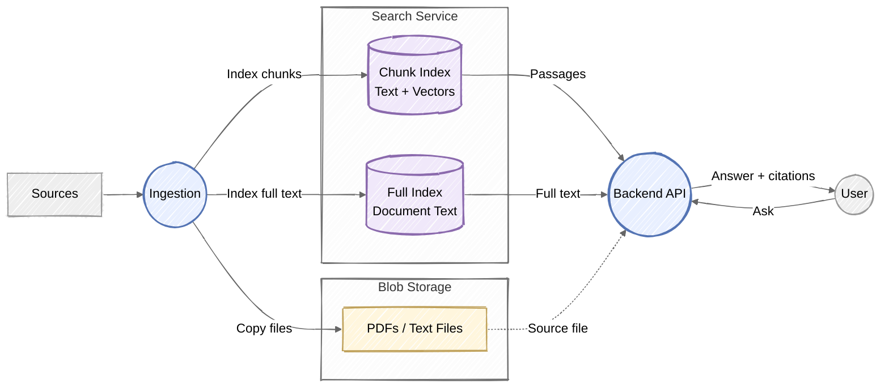

# Visual-First Diagrams

Draw the system, not paragraphs in boxes. Start with the main flow and add detail
only when requested. The reader should understand the picture before reading any
supporting prose.

## 1. Establish the Main Flow

- Inspect the implementation or supplied documentation before drawing connections.
  Distinguish confirmed behavior from assumptions; do not invent components.
- Identify the actors, services, stores, stored artifacts, and primary reads/writes.
- Match the user's sketch and level of detail when provided. Preserve its visual
  grouping rather than reproducing a screenshot as a list of text-heavy nodes.
- For a first overview, aim for roughly 5-10 meaningful nodes. Omit secondary jobs,
  schedules, field lists, retries, and infrastructure plumbing unless essential.
- If a boundary is unclear and changes the picture, ask one focused question.
  Otherwise draw the confirmed scope and briefly state what is omitted.

## 2. Make Structure Carry the Meaning

- Use circles for actors or services, cylinders for indices or databases, and
  compact rectangles for files or artifacts. Keep shape meanings consistent.
- Use subgraphs as visual containers: show files inside storage and individual
  indices inside the search service. Nest only when the distinction matters,
  such as staging versus published content.
- Keep labels to a few words, usually one or two short lines. Put details in
  supporting prose or a later diagram, never a paragraph inside a node.
- Name the actual stored representation: source files, text chunks, embeddings,
  full text, or structured records. Do not imply that an index stores original
  binaries or that a full-document lookup downloads a file unless verified.
- Prefer a left-to-right layout for sources, processing, storage, and consumers.
  Change direction if it reduces crossings or better matches the user's sketch.
- Use short verb labels on edges: "Extract", "Index", "Search", "Read full text".
  Number edges only when their order is real and useful.
- Make arrow direction unambiguous. In a data-flow view, store-to-backend arrows
  mean returned content; in a request view, backend-to-store arrows mean queries.
  Label them accordingly rather than silently mixing the two conventions.
- Separate answering from source-file viewing when they take different paths.
  Use dashed arrows for an optional or secondary path and explain their meaning.
- Use a small, muted palette to reinforce grouping, not as the only way to tell
  components apart. Do not add decorative icons or unrelated nodes.

## 3. Use a Lightweight Mermaid Style

Default to Mermaid with `look: handDrawn` and `theme: neutral` for a sketch-like
appearance. If the target renderer does not support that configuration, remove
the unsupported options and keep the same shapes and grouping. Never depend on
the sketch effect for meaning.

Use this as a visual pattern, not an architecture to copy without verification:

In this example, answers use indexed text. The dashed path serves a source file
when the user opens an asset; it is not the model's retrieval path.

## 4. Check and Deliver

- Check every arrow against the implementation, including which service reads
  which store and whether parallel paths are genuinely independent.
- Render with an available Mermaid renderer and inspect clipping, crossings,
  label length, and overall readability. If rendering is unavailable, check the
  syntax and explicitly say the visual layout was not verified.
- If the diagram still looks like a collection of text boxes, remove detail
  before adding more styling. Split into focused views instead of shrinking text.
- Lead with the diagram and at most one sentence of introduction. Follow with
  only the key distinction, a short legend if needed, and any scope caveat.
- Keep implementation references outside the diagram. Include a few links when
  grounding a repository explanation, not a long file-by-file walkthrough.
- Return a fenced Mermaid block by default. When asked for a document, place it
  in the repository's existing documentation location and avoid unrelated edits.
